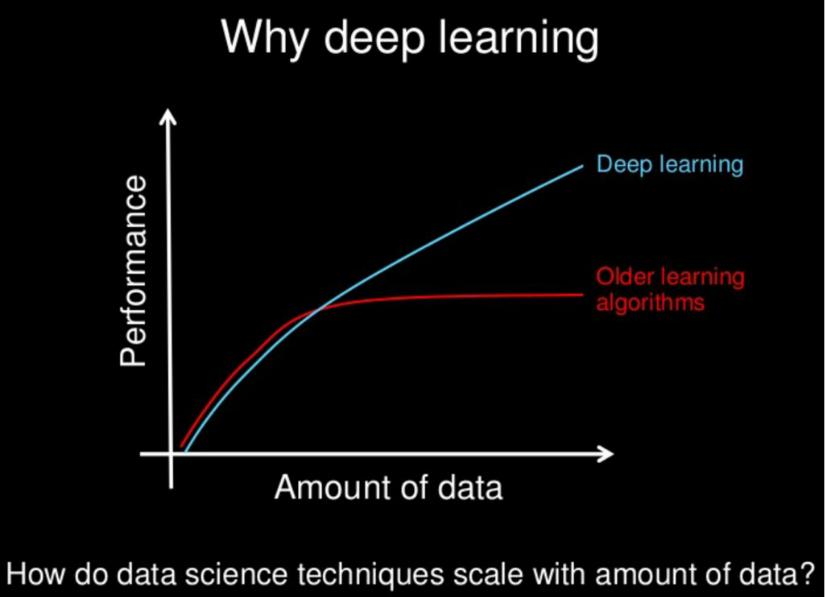

# Session Slide: Introduction to Neural Networks & its working

### **Why Deep Learning?**

* With increase in data, there is increase in the performance of the algorithm.
* The same is not true for other Machine learning algorithms, as they reach a plateau after a certain amount of data is provided
* Deep Learning is not a new technique, it has been around for decades, but it has only gained popularity in the last 15 years
* **Reason Being- Enormous increase in availability of data.**

### **Brain Neurons**

* In brain neurons, signal is transmitted from one neuron to another till it reaches the nerve endings.

* **SYNAPSE**: The transfer of electric signal between two neurons

### **Neural Networks**

* As the name suggests, Neural networks (also called as Artificial Neural Networks ANN) are inspired by the neurons in the human brain.

>)

### **Perceptron- Single Layer Perceptron**

* Before we begin talking about Perceptron, let us look at a general dataset

### **Perceptron-Single Layer Perceptron**

* Like a single unit in Neural Network is called Neuron, the single most basic unit in Artificial neural network is called Perceptron.
* The various features of our dataset (independent values) are given as input x1, x2, x3,.... xn.
* Each input feature is given a weight to determine how important it is.
* Perceptron makes a decision y (dependent variable) on the basis of an activation function.

### **Multi Layer Perceptron**

When a perceptron that teams up with additional perceptrons, stacked in several layers, to solve complex problems.

In this example, we have three layers-

* **Input layer**
* **Hidden Layer**
* **Output Layer**

### **What are Hidden Layers?**

Hidden layers constitute of all the layers in a Neural Network other than the input and the output layer - Hence the word hidden.

* Hidden layers act like a black box - the internal mechanism is hidden.
* Each layer contributes to the final output layer by applying some mathematical transformations.

### **When is a Neural Network Called Deep?**

* **Whenever there are more than 3 layers (Input, Hidden, Output) in a Neural Network, we call it a deep Neural network.**

* Each hidden layer has a certain meaning for the final classification.
* Each layer helps in classifying, a certain aspect of the final output layer

### **What do hidden layers do?**

**Let us consider a facial recognition Neural Network**

* The initial layers start small - They identify edges
* The middle layer start to identify objects - like eyes, nose, ears etc.
* The final layers start to identify the final images and hence recognise the entire face.

### **Forward and Backward Propagation**

* **Forward Propagation:** Signal goes from input layers towards output layers
* **Backward Propagation:** Signal goes from output to input layers

### **Classification with Neural Networks**

Classification: **Predicting what class/group certain element belongs to.**

* Classify whether a person has a disease or not
* Classify whether a person will repay loan or not
* Classify emails as spam or not&#x20;
* Apply face recognition to identify people
* And many many many more...

### **Neural Network Working: Handwriting recognition**

{% embed url="https://www.google.com/url?q=http%3A%2F%2Fwww.youtube.com%2Fwatch%3Fv%3D3JQ3hYko51Y&sa=D&source=editors&usg=AOvVaw3ppNzkDvXPOdR85nHnLOFs&ust=1647269574797154" %}

### **Frameworks for DL in Python**

*   **TensorFlow:**&#x20;

    * Google’s DL framework.&#x20;
    * Can also work on ioS and Android

    ****
* **Pytorch:**&#x20;
  * Operates with a dynamically updated graph. It allows you to make changes to the architecture in the process.
* **Sonnet:**
  * It is built on top of TensorFlow. Designed to create neural networks with a complex architecture by DeepMind.&#x20;
  * Mostly used to reproduce the research demonstrated in DeepMind’s papers with greater ease than Keras, since DeepMind will be using Sonnet themselves.

**Let’s start working on deep learning techniques!**
